# 🏢 PROJECT REPORT & ENTITY-RELATIONSHIP (ER) DIAGRAM
## **SocietySync: Enterprise Residential Society Management Platform**

---

### **STUDENT & DEVELOPER PROFILE**
- **Student Name:** Gandhi Kalasi
- **Degree / Field:** Computer Science & Engineering (BCA / B.Tech CSE)
- **Institution Address:** Bhubaneswar, Odisha, India (`751001`)
- **Contact Email:** [gandhikalasi115@gmail.com](mailto:gandhikalasi115@gmail.com) | **Phone:** `+91 9348605226`
- **GitHub Repository:** [https://github.com/GANDHIKALASI/society-sync](https://github.com/GANDHIKALASI/society-sync)
- **Live Hosted Application:** [https://society-sync-three.vercel.app](https://society-sync-three.vercel.app)

---

## 1. ABSTRACT & PROJECT OVERVIEW

### **1.1 Problem Statement**
Traditional residential gated communities rely heavily on manual ledger entries, unorganized WhatsApp groups, paper-based visitor registers, and physical maintenance cash/cheque collection. This leads to operational bottlenecks:
1. **Unverified Visitors & Security Risks:** Lack of real-time approval mechanisms for guest entry.
2. **Delayed Dues & Accounting Errors:** Manual tracking of monthly maintenance bills leads to unpaid balances and lost physical receipts.
3. **Unresolved Complaints:** Resident grievances get buried without ticket status tracking or staff assignment accountability.
4. **Staff Management Gaps:** Absence of digital daily attendance and duty assignment tracking for security and facility staff.

### **1.2 Proposed Solution: SocietySync**
**SocietySync** is a unified, cloud-native, role-based residential society management system. Built with **Next.js 16 App Router**, **TypeScript**, and **Supabase PostgreSQL**, it digitizes all core housing operations into three synchronized role workspaces:
- 💎 **Super Admin Workspace:** Master oversight of residents, staff, billing, notices, and approval events.
- 🍏 **Resident Workspace:** Visitor pass generation with security codes, instant maintenance payments, service ticketing, and community communication.
- 🍑 **Employee Workspace:** Digital attendance clock-in/out, work order execution, and leave management.

---

## 2. ENTITY-RELATIONSHIP (ER) DIAGRAM

The database model consists of **25 relational tables** hosted on **Supabase PostgreSQL**.

```mermaid
erDiagram
    SOCIETIES ||--o{ PROFILES : "belongs_to"
    SOCIETIES ||--o{ BLOCKS : "contains"
    SOCIETIES ||--o{ FLATS : "contains"
    SOCIETIES ||--o{ VISITOR_PASSES : "logs"
    SOCIETIES ||--o{ MAINTENANCE_BILLS : "issues"
    SOCIETIES ||--o{ COMPLAINTS : "manages"
    SOCIETIES ||--o{ SERVICE_REQUESTS : "receives"
    SOCIETIES ||--o{ EMPLOYEE_TASKS : "assigns"
    SOCIETIES ||--o{ ANNOUNCEMENTS : "broadcasts"
    SOCIETIES ||--o{ EVENTS : "hosts"

    PROFILES ||--o{ FAMILY_MEMBERS : "has"
    PROFILES ||--o{ VEHICLES : "owns"
    PROFILES ||--o{ PETS : "owns"
    PROFILES ||--o{ VISITOR_PASSES : "requests"
    PROFILES ||--o{ MAINTENANCE_BILLS : "receives"
    PROFILES ||--o{ PAYMENTS : "makes"
    PROFILES ||--o{ RECEIPTS : "holds"
    PROFILES ||--o{ COMPLAINTS : "files"
    PROFILES ||--o{ SERVICE_REQUESTS : "creates"
    PROFILES ||--o{ EMPLOYEE_TASKS : "assigned_to"
    PROFILES ||--o{ ATTENDANCE : "clocks"
    PROFILES ||--o{ LEAVE_REQUESTS : "submits"
    PROFILES ||--o{ NOTIFICATIONS : "receives"
    PROFILES ||--o{ CHAT_MESSAGES : "sends_receives"

    MAINTENANCE_BILLS ||--o{ PAYMENTS : "settled_by"
    PAYMENTS ||--|| RECEIPTS : "generates"
    COMPLAINTS }|--|| PROFILES : "assigned_employee"
    SERVICE_REQUESTS }|--|| PROFILES : "assigned_employee"

    SOCIETIES {
        uuid id PK
        string name
        string code UK
        string address
        string city
        string state
        string pincode
        numeric maintenance_rate
        timestamp created_at
    }

    PROFILES {
        uuid id PK, FK
        string full_name
        string phone
        string email
        string role "super_admin | resident | employee"
        string status "pending | approved | rejected | suspended"
        uuid society_id FK
        string block
        string flat_number
        string occupancy_type "owner | tenant | family"
        string designation
        timestamp created_at
    }

    BLOCKS {
        uuid id PK
        uuid society_id FK
        string name
        int total_floors
        int total_flats
        timestamp created_at
    }

    FLATS {
        uuid id PK
        uuid society_id FK
        string block_name
        string flat_number
        int floor_number
        string status "occupied | vacant | under_maintenance"
        string owner_name
        string tenant_name
    }

    VISITOR_PASSES {
        uuid id PK
        uuid society_id FK
        uuid resident_id FK
        string visitor_name
        string visitor_phone
        string vehicle_number
        date visit_date
        string pass_code
        string status "pending | approved | checked_in | checked_out"
    }

    MAINTENANCE_BILLS {
        uuid id PK
        uuid society_id FK
        uuid profile_id FK
        string flat_number
        string title
        numeric amount
        date due_date
        string status "pending | paid | overdue"
        string period
    }

    PAYMENTS {
        uuid id PK
        uuid bill_id FK
        uuid profile_id FK
        numeric amount
        string payment_method
        string transaction_id
        string status "completed | pending | failed"
        timestamp paid_at
    }

    RECEIPTS {
        uuid id PK
        uuid payment_id FK
        string receipt_number UK
        uuid profile_id FK
        numeric amount
        timestamp issued_at
    }

    COMPLAINTS {
        uuid id PK
        uuid society_id FK
        uuid profile_id FK
        string category
        string title
        string description
        string priority "low | medium | high | urgent"
        string status "open | in_progress | resolved | closed"
        uuid assigned_employee_id FK
    }

    EMPLOYEE_TASKS {
        uuid id PK
        uuid society_id FK
        uuid employee_id FK
        uuid assigned_by FK
        string title
        string description
        string priority
        string status "pending | in_progress | completed"
        date due_date
    }

    ATTENDANCE {
        uuid id PK
        uuid employee_id FK
        date attendance_date
        timestamp check_in
        timestamp check_out
        string status "present | absent | half_day"
    }
```



---

## 3. DATA DICTIONARY & SCHEMA DESCRIPTIONS

### **3.1 `societies` Table**
| Column | Type | Constraints | Description |
| :--- | :--- | :--- | :--- |
| `id` | `UUID` | Primary Key, `gen_random_uuid()` | Unique identifier for society |
| `name` | `TEXT` | `NOT NULL` | Full name of the residential complex |
| `code` | `TEXT` | `NOT NULL, UNIQUE` | Society identification code (e.g. `SSGR01`) |
| `maintenance_rate` | `NUMERIC(10,2)` | `DEFAULT 2500.00` | Standard monthly base maintenance rate |

### **3.2 `profiles` Table (User Account Metadata)**
| Column | Type | Constraints | Description |
| :--- | :--- | :--- | :--- |
| `id` | `UUID` | Primary Key, Foreign Key (`auth.users.id`) | Maps 1:1 with Supabase Auth user ID |
| `full_name` | `TEXT` | `NOT NULL` | User full name |
| `role` | `TEXT` | `CHECK (role IN ('super_admin', 'resident', 'employee'))` | Role workspace access level |
| `status` | `TEXT` | `CHECK (status IN ('pending', 'approved', 'rejected', 'suspended'))` | Approval status by Super Admin |
| `block` | `TEXT` | Nullable | Assigned block/tower designation |
| `flat_number` | `TEXT` | Nullable | Apartment flat identifier |

### **3.3 `visitor_passes` Table**
| Column | Type | Constraints | Description |
| :--- | :--- | :--- | :--- |
| `id` | `UUID` | Primary Key | Pass reference ID |
| `resident_id` | `UUID` | Foreign Key (`profiles.id`) | Resident who created the guest pass |
| `visitor_name` | `TEXT` | `NOT NULL` | Guest name |
| `pass_code` | `TEXT` | Unique Token | Security passcode checked at gate |
| `status` | `TEXT` | `CHECK ('approved', 'checked_in', 'checked_out')` | Gate security pass status |

---

## 4. SYSTEM ARCHITECTURE & MODULE WORKSPACES

### **4.1 Super Admin Module (Executive Management)**
- **User Verification:** Review pending resident registrations; grant or revoke system access.
- **Staff Duty Allocation:** Create work order tasks (`employee_tasks`) and assign responsible technicians or security officers.
- **Financial Auditing:** Issue maintenance invoices and monitor ledger receipts in real time.
- **Notice Dispatch:** Publish emergency broadcasts (`announcements`) accessible across resident dashboards.

### **4.2 Resident Module (Community Portal)**
- **Digital Guest Invites:** Generate 6-digit visitor pass codes (`visitor_passes`) for seamless gate verification.
- **Maintenance Payments:** Pay monthly maintenance bills (`maintenance_bills`) via digital payment methods (`payments`) and generate auto-numbered receipts (`receipts`).
- **Grievance Ticketing:** File complaints (`complaints`) and service requests with priority levels (`urgent`, `high`, `medium`, `low`).

### **4.3 Employee Module (Staff Operations)**
- **1-Tap Attendance:** Daily check-in/out timestamping recorded in `attendance` table.
- **Task Resolution:** View assigned maintenance jobs and mark progress from `pending` to `completed`.
- **Leave Applications:** Submit casual/sick leave requests (`leave_requests`) for administrator review.

---

## 5. SECURITY & DATABASE PROCEDURES

### **5.1 Row-Level Security (RLS)**
Every table in the database has Row-Level Security (`ALTER TABLE ... ENABLE ROW LEVEL SECURITY`) activated. All data access is strictly governed by `auth.uid() IS NOT NULL` checking.

### **5.2 Idempotent Database Trigger (`handle_new_user`)**
When a new user registers through Supabase Auth, PostgreSQL executes an automated trigger that populates the `public.profiles` table:
```sql
CREATE OR REPLACE FUNCTION public.handle_new_user()
RETURNS TRIGGER AS $$
DECLARE
  default_society_id UUID;
BEGIN
  SELECT id INTO default_society_id FROM public.societies LIMIT 1;
  INSERT INTO public.profiles (id, full_name, phone, email, role, status, society_id, block, flat_number, occupancy_type)
  VALUES (
    NEW.id,
    COALESCE(NEW.raw_user_meta_data->>'full_name', NEW.email),
    NEW.raw_user_meta_data->>'phone',
    NEW.email,
    COALESCE(NEW.raw_user_meta_data->>'role', 'resident'),
    'pending',
    default_society_id,
    NEW.raw_user_meta_data->>'block',
    NEW.raw_user_meta_data->>'flat_number',
    NEW.raw_user_meta_data->>'occupancy_type'
  );
  RETURN NEW;
END;
$$ LANGUAGE plpgsql SECURITY DEFINER;
```

### **5.3 Real-Time Password Recovery Stored Procedure (`reset_user_password`)**
Bypasses external SMTP rate limits by updating `auth.users.encrypted_password` with PostgreSQL `pgcrypto` `bcrypt` encryption directly in database:
```sql
CREATE OR REPLACE FUNCTION public.reset_user_password(user_email TEXT, new_password TEXT)
RETURNS BOOLEAN AS $$
DECLARE
  target_user_id UUID;
BEGIN
  SELECT id INTO target_user_id FROM auth.users WHERE lower(email) = lower(user_email) LIMIT 1;
  IF target_user_id IS NULL THEN RETURN FALSE; END IF;

  UPDATE auth.users
  SET encrypted_password = crypt(new_password, gen_salt('bf')),
      updated_at = now()
  WHERE id = target_user_id;

  RETURN TRUE;
END;
$$ LANGUAGE plpgsql SECURITY DEFINER;
```

---

## 6. TECHNICAL SPECIFICATIONS

- **Frontend Application Framework:** Next.js 16 (React 19, Turbopack, App Router)
- **Programming Language:** TypeScript 5.0
- **Database Engine:** Supabase PostgreSQL 15
- **Authentication Engine:** Supabase Auth (JWT Token Management)
- **Styling & UI System:** Glassmorphism Vanilla CSS & Tailwind CSS 4.0
- **Iconography:** Lucide React
- **Cloud Hosting & Deployment:** Vercel & GitHub Actions CI/CD Pipeline
