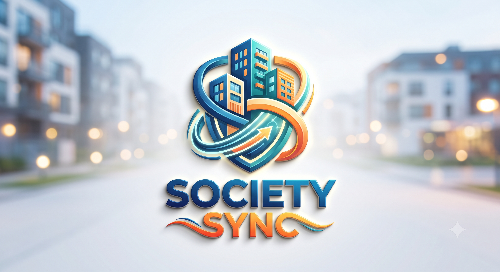

<div align="center">

  

  # 🏢 SocietySync
  ### *Enterprise Residential Society Management Platform*

  [](https://nextjs.org/)
  [](https://www.typescriptlang.org/)
  [](https://supabase.com/)
  [](https://tailwindcss.com/)
  [](#-license)

  [**🌐 Live Demo**](https://society-sync-three.vercel.app) • [**📚 GitHub Repo**](https://github.com/GANDHIKALASI/society-sync) • [**👨‍💻 Developer Profile**](#-designed--developed-by)

</div>

---

## 📖 Overview

**SocietySync** is a modern, enterprise-grade gated community and residential society management platform. Designed to eliminate manual paperwork and fragmented communication, SocietySync connects **Super Administrators**, **Residents**, and **Staff Employees** into a single, unified workspace with custom role-based themes, real-time security approvals, maintenance billing, and visitor logging.

---

## 🎨 Role-Based Design Systems

SocietySync features dedicated visual workspaces tailored specifically to each user role:

| Role | Accent Theme | Dark Mode Background | Primary Purpose |
| :--- | :--- | :--- | :--- |
| 💎 **Super Admin** | **Fresh Canopy / Tiffany** (`#21F1A8`) | Obsidian Emerald (`#0A2D26`) | Executive administration, resident approvals, employee management, and billing ledgers. |
| 🍏 **Resident** | **Lime Sprout** (`#E4FD97`) | Dark Forest (`#2D3E2C`) | Visitor pass generation, maintenance bill payments, complaints, and community chat. |
| 🍑 **Employee** | **Bridal Skin Tone / Turmeric** (`#FFC6A8`) | Deep Mahogany (`#3B1B22`) | Operational duty, daily attendance check-in/out, task resolution, and leave requests. |
| 🔐 **Auth Gateway** | **Malt** (`#F0EDE4`) | Deep Teal (`#004741`) | Secure, glassmorphic sign-in, registration, and OTP password recovery portal. |

---

## ✨ Key Features & Modules

### 💎 Super Admin Panel
- **Resident Directory & Approval Workflow:** View pending registrations, approve or restrict access with automated status logs.
- **Employee & Staff Management:** Register, track, and assign duties to security personnel, maintenance staff, and facility managers.
- **Society Blocks & Towers Setup:** Configure towers, floor counts, and flat allocations across the society.
- **Maintenance Billing Ledger:** Issue monthly maintenance bills, track payment statuses, and review transaction history.
- **Notice Board & Announcements:** Dispatch emergency notices and broadcasts across all resident devices.

### 🍏 Resident Panel
- **Digital Visitor Passes:** Generate instant QR/Code visitor passes with entry and exit tracking for guest safety.
- **UPI Bill Payments:** View pending maintenance dues, make payments, and generate digital payment receipts.
- **Service & Complaint Ticketing:** Raise complaints and facility requests with real-time progress updates.
- **Community Chat & Event Directory:** Engage in society discussions and view upcoming festival and meeting schedules.
- **My Assets Directory:** Register family emergency contacts, vehicles, and pets.

### 👷 Employee Panel
- **1-Tap Attendance Check-In / Check-Out:** Clock in and clock out daily with date-stamped attendance logs.
- **Task Fulfillment:** View assigned maintenance duties, mark progress, and close tickets.
- **Leave Request Management:** Submit casual/sick leave requests to society administrators.

### 🔐 Security & Authentication
- **Supabase PostgreSQL & Row Level Security (RLS):** Fully isolated data queries ensuring user privacy.
- **Real-Time OTP Password Recovery:** Database-backed password reset system powered by PostgreSQL `pgcrypto` bcrypt hashing.

---

## 🛠️ Tech Stack

- **Framework:** Next.js 16 (App Router, Turbopack)
- **Language:** TypeScript
- **Backend & Database:** Supabase (PostgreSQL, Auth, Realtime)
- **Styling:** Vanilla CSS Design System & Tailwind CSS
- **Icons:** Lucide React

---

## 🚀 Quick Setup & Installation

### 1. Clone the Repository
```bash
git clone https://github.com/GANDHIKALASI/society-sync.git
cd society-sync/public/society-scan
```

### 2. Install Dependencies
```bash
npm install
```

### 3. Configure Environment Variables (`.env.local`)
Create a `.env.local` file in the root directory:
```env
NEXT_PUBLIC_SUPABASE_URL=https://your-project.supabase.co
NEXT_PUBLIC_SUPABASE_ANON_KEY=your-supabase-anon-key
```

### 4. Setup Database Schema
Execute `supabase/schema.sql` followed by `supabase/seed.sql` in your **Supabase SQL Editor**.

### 5. Run Development Server
```bash
npm run dev
```
Open [http://localhost:3000](http://localhost:3000) in your browser.

---

## 👨‍💻 Designed & Developed By

<div align="center">

  ### **Gandhi Kalasi**
  *Full Stack Developer & AI Software Engineer*

  📍 **Location:** Bhubaneswar, Odisha, India (`751001`)  
  📞 **Phone:** `+91 9348605226`  
  📧 **Email:** [gandhikalasi115@gmail.com](mailto:gandhikalasi115@gmail.com)

  [](https://github.com/GANDHIKALASI)
  [](https://instagram.com/bug_gandhi)
  [](https://t.me/bug_gandhi)

</div>

---

## 📄 License

This project is licensed under the [MIT License](LICENSE) - feel free to use and modify for personal or commercial projects.
