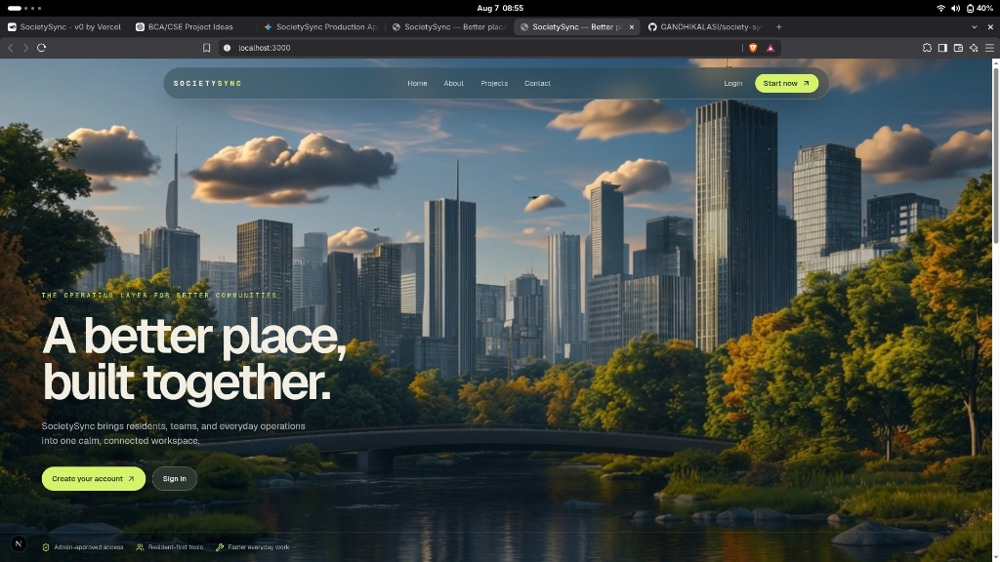

  # 🏢 SocietySync
  ### *Enterprise Residential Society Management Platform*

  [**🌐 Live Application**](https://society-sync-three.vercel.app) • [**👨‍💻 Developer Contact**](#-designed--developed-by)

   

  

---

## 📖 About SocietySync

**SocietySync** is a modern, enterprise-grade gated community and residential society management platform. It streamlines society administration by connecting **Super Administrators**, **Residents**, and **Staff Employees** into a single, synchronized platform with role-based dashboards, automated visitor management, digital billing, and real-time security approvals.

---

## 🎨 Dedicated Role Workspaces

SocietySync features dedicated, color-coded visual workspaces tailored to each user role:

- 💎 **Super Admin Panel (`#21F1A8` Tiffany & Deep Obsidian Emerald)**  
  Executive administration, resident directory approvals, staff management, notice broadcasts, and maintenance billing ledgers.

- 🍏 **Resident Panel (`#D7F36B` Lime Sprout & Deep Midnight Forest)**  
  Digital visitor pass generation with security codes, maintenance bill UPI payments, service ticket tracking, and community events.

- 🍑 **Employee Panel (`#FFC6A8` Bridal Skin Tone & Deep Mahogany)**  
  Operational staff workspace for daily attendance check-in/out, assigned maintenance task fulfillment, and leave request management.

- 🔐 **Authentication Gateway (`#F0EDE4` Malt & Deep Teal)**  
  Secure login, resident registration, and real-time password recovery portal.

---

## 👨‍💻 Designed & Developed By

  ### **Gandhi Kalasi**
  *Full Stack Developer & AI Software Engineer*

  📍 **Location:** Bhubaneswar, Odisha, India (`751001`)  
  📞 **Phone:** `+91 7008397690`  
  📧 **Email:** [gandhikalasi115@gmail.com](mailtoodcyberforce@gmail.com)

  
  
  

---

## 🔒 Proprietary Application

This project is a proprietary application designed and built by Gandhi Kalasi. All rights reserved.
